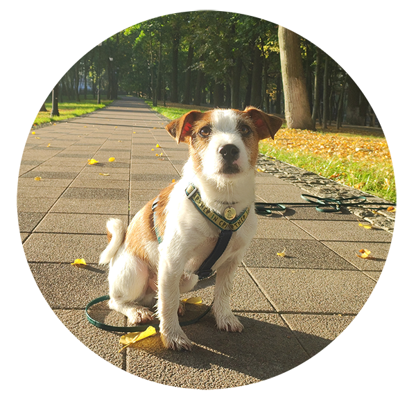
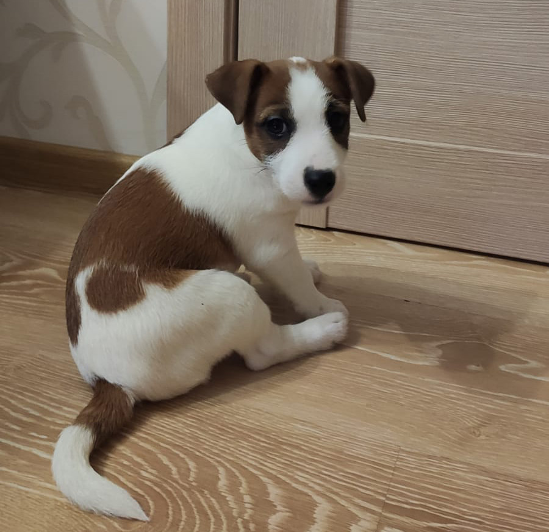
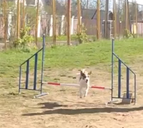
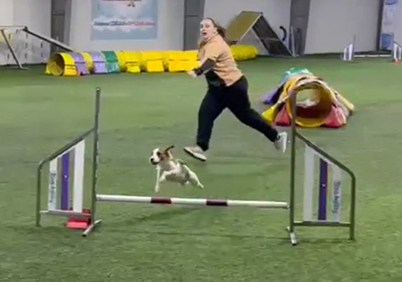
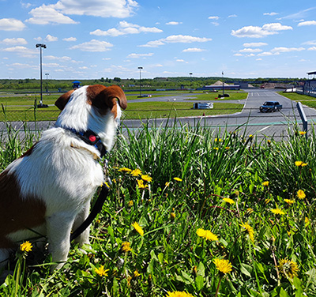
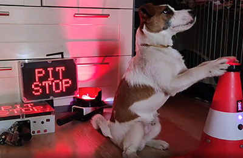

# Кими. Старательный и неутомимый.

**Кими** (по документам **Ragnar Brave Tail**)- собака породы [_Джек-Рассел-терьер_](https://ru.wikipedia.org/wiki/%D0%94%D0%B6%D0%B5%D0%BA-%D1%80%D0%B0%D1%81%D1%81%D0%B5%D0%BB-%D1%82%D0%B5%D1%80%D1%8C%D0%B5%D1%80). Родился 9 ноября 2021 года в городе Волгограде. Первые полтора месяца его жизни прошли довольно посредственно, да и откуда взяться чему-то необычному, если из дома выходить нельзя. К счастью для него, всё изменилось 30 декабря.

## Первые успехи
Конечно же, первым делом новые хозяева дали Кимстеру несколько дней, чтобы освоиться, привыкнуть к запахам и обстановке. Для совместных активностей предлагались разные игрушки: мячики, канатики, плюшевый бобер с шуршащим хвостом и даже тапки. Кстати, именно ***тапки*** особенно полюбились малышу! 
Спустя месяц Кими освоил немало стандартных и различных трюковых команд. Вот некоторые из них:
* Сидеть, лежать, стоять
* Место (_лечь в лежанку_)
* Домик (_пепсу нужно зайти в вольер или переноску_)
* Выходи (_применяется после команды_ __Домик__)
* Суслик (_он же зайка_)
* Команда "Дай лапу"
* Ле и Пра (_Обход препятствий с двух сторон_)
* "Тач" (_коснись объекта_)
* И, конечно же, __Гуляй!__ (_по этой команде собака может заниматься своими собачьими делами и наконец-то расслабиться_)

Это лишь малая часть того, что он успел освоить за столь короткий промежуток времени! Как только закончился обязательный прививочный карантин, Кими стал путешествовать. За два года он трижды был в Карелии (один раз практически на границе с Финляндией - в горном парке __Рускеала__), два раза в Санкт-Петербурге, был в Костроме, Серпухове, Дмитрове Смоленске и несколько Рязани. В планах поездки за границу, а также масштабное путешествие на озеро Байкал. А пока планы строятся, практически всё свободное время Кими уходит на сон. 

## Аджилити
В 1 год и 2 месяца собакен в первый раз пошел на аджилити. Первое занятие прошло настолько успешно, что уже спустя два месяца он взял свой первый приз на соревнованиях в Костроме - медаль за второе место, диплом и __банка вкуснейшего паштета__!

 

В __сентябре__ Кими принял участие в очередных соревнованиях. И на сегодняшний день это его лучшее выступление. 1 место в категории Д0 (_джампинг, новички_)! 

Конечно же, это не повод останавливаться на достигнутом. Тренировочный процесс идет полным ходом. Впереди новые старты, более сложные трассы, сильные соперники и совершенно непредсказуемые условия. Всё получится, нужно лишь подготовиться!

## Автоспорт
Хочется упомянуть еще одну сторону жизни этого невероятного собакена. Помимо понятных собачьих активностей, Кими регулярно посещает автомобильные соревнования. Пока в качестве зрителя, зато очень увлеченного! Кстати, иногда Кими помогает проверять оборудование для проведения соревнований по [***картингу***](https://ru.wikipedia.org/wiki/%D0%9A%D0%B0%D1%80%D1%82%D0%B8%D0%BD%D0%B3). 

 

## Заключение
Собачьи возможности практически безграничны. Но самое главное, что всё это делается с оглядкой на реакцию главного героя этой статьи. Он не боится шума, большого скопления людей или машин, он самый смелый! Но самое главное - беситься и играть Кими готов всегда и везде, он любит взаимодействовать с людьми и сородичами, а значит нет причин держать этого мохнатыша в четырех стенах!

#TrendFunnyPet